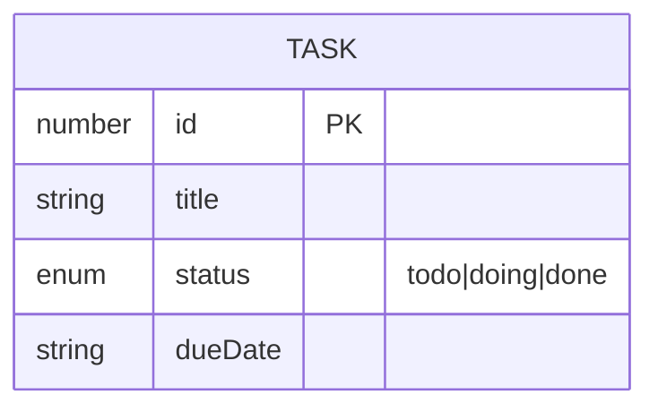
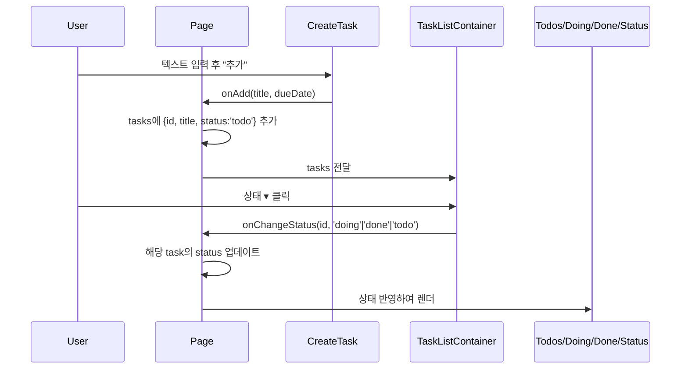

## 1. 아키텍처 설계

```mermaid
graph TD
  A[사용자 브라우저] --> B[Next.js 16 App Router]

  subgraph "프론트엔드 컴포넌트"
    B --> P[Page (상태 보유)]
    P --> CT[CreateTask]
    P --> SB[SearchBar]
    P --> FT[Filter]
    P --> TLC[TaskListContainer]
    TLC --> TL[TaskList]
    TL --> TI[TaskItem]
    TI --> DL[DropdownList]
  end

  subgraph "데이터 저장"
    M[(클라이언트 메모리 상태)]
  end

  P --> M
  TLC --> M
```

## 2. 기술 설명
- 프론트엔드: Next.js 16 App Router + TypeScript + Tailwind CSS v3 + React 19
- 초기화/개발: npm + Next dev (Turbopack)
- 백엔드: 없음 (클라이언트 사이드 상태로만 동작)
- 상태 관리: React hooks (useState)
- 데이터 저장: 클라이언트 메모리 상태(영속화 없음)
- 유틸리티: clsx, tailwind-merge
- 폰트: Pretendard (local)

## 3. 라우트 정의
| 라우트 | 목적 |
| --- | --- |
| / | 메인 페이지: 추가/상태변경/리스트/요약 |

## 4. 데이터 모델

### 4.1 데이터 모델 정의


### 4.2 TypeScript 타입 정의
```typescript
export interface Task {
  id: number;
  title: string;
  status: 'todo' | 'doing' | 'done';
  dueDate?: string;
}
```

### 4.3 데이터 흐름

