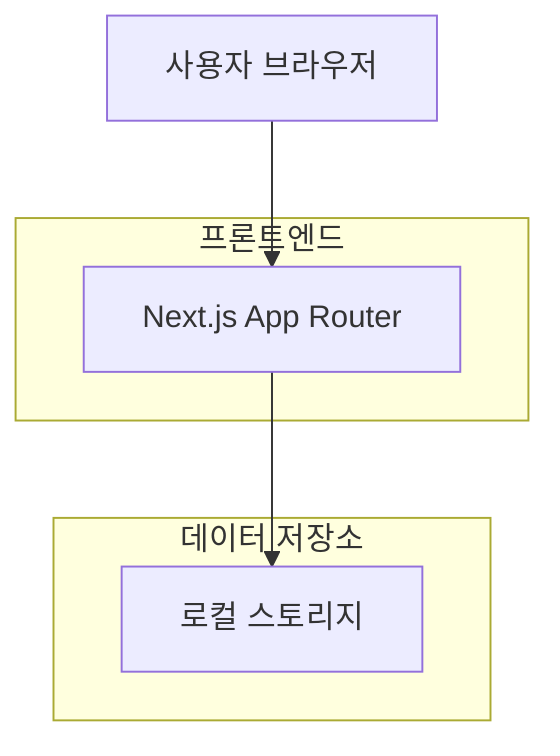
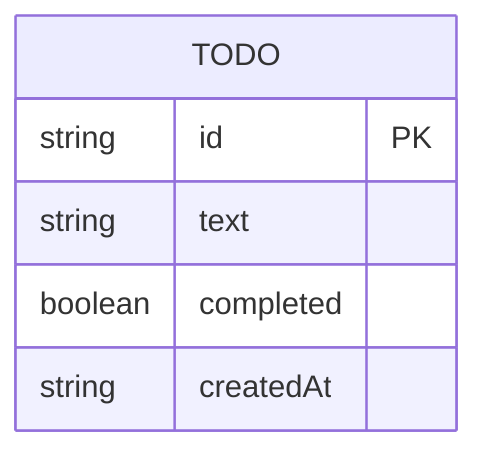

## 1. 아키텍처 설계



## 2. 기술 설명
- 프론트엔드: Next.js 14 App Router + TypeScript + Tailwind CSS v4
- 초기화 도구: create-next-app
- 백엔드: 없음 (클라이언트 사이드 렌더링)
- 상태 관리: React hooks (useState, useEffect)
- 데이터 저장소: 브라우저 로컬 스토리지
- 유틸리티: clsx, tailwind-merge (조건부 스타일링)

## 3. 라우트 정의
| 라우트 | 목적 |
|-------|---------|
| / | 메인 페이지, Todo 목록 표시 및 관리 |

## 4. 데이터 모델

### 4.1 데이터 모델 정의


### 4.2 TypeScript 타입 정의
```typescript
interface Todo {
  id: string;
  text: string;
  completed: boolean;
  createdAt: string;
}
```

### 4.3 로컬 스토리지 구조
- 키: 'todos'
- 값: Todo[] (JSON 문자열)
- 초기값: 빈 배열 []