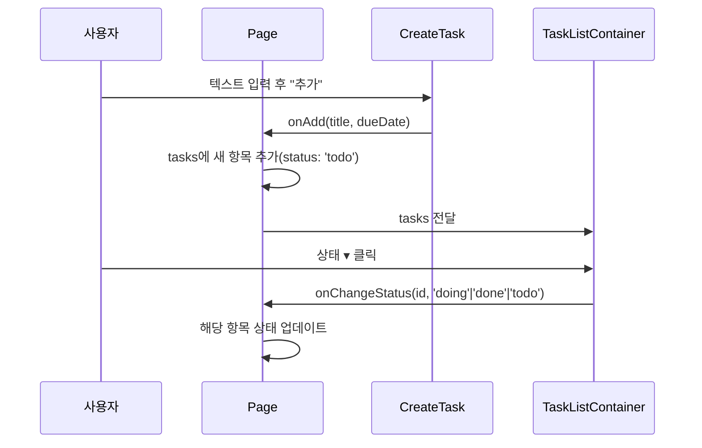

## 1. 제품 개요
Next.js 기반의 간단한 Todo 웹 서비스로, 작업 추가와 상태 변경을 통해 개인 작업을 관리합니다. 현재 버전은 클라이언트 메모리 상태만 사용합니다.

## 2. 핵심 기능

### 2.1 사용자 역할
이 제품은 별도의 사용자 인증 없이 단일 사용자 모드로 작동합니다.

### 2.2 기능 모듈
| 모듈 | 역할 |
|------|------|
| CreateTask | `textarea` 입력 후 "추가"로 작업 생성(옵션: 마감일) |
| Todos | `status: 'todo'` 작업 목록, 드롭다운으로 상태 이동 |
| DoingTasks | `status: 'doing'` 작업 목록 표시 |
| DoneTasks | `status: 'done'` 작업 목록 표시 |
| TaskStatus | 전체/진행중/완료 개수 요약 표시 |
| SearchBar | 입력값 정규화 후 제목 포함 검색 |
| Filter | 상태별(`all/todo/doing/done`) 및 마감일 정렬(오름/내림) |

### 2.3 페이지 상세
| 페이지명 | 모듈명 | 기능 설명 |
|-----------|-------------|-------------|
| 메인 페이지 | CreateTask | `textarea` 입력 후 "추가" 버튼으로 신규 작업 생성 |
| 메인 페이지 | Todos | `status: 'todo'` 항목 리스트, 드롭다운으로 상태 변경 |
| 메인 페이지 | DoingTasks | `status: 'doing'` 항목 리스트 표시 |
| 메인 페이지 | DoneTasks | `status: 'done'` 항목 리스트 표시 |
| 메인 페이지 | TaskStatus | 전체/진행중/완료 개수 요약 표시 |
| 메인 페이지 | Filter/SearchBar | 상태 필터/마감일 정렬/검색 입력 |

## 3. 핵심 프로세스


## 4. 사용자 인터페이스 설계

### 4.1 디자인 스타일
- 주요 색상: Tailwind 테마 기반 gray(25~950), primary(100/500)
- 상태 색상: doing(녹색 톤), done(빨간색 톤)
- 버튼 스타일: 둥근 모서리, 플랫, 테마 색상 호버 적용
- 폰트: Pretendard(local)
- 레이아웃: 중앙 정렬 카드 레이아웃(`max-w-md`, `border`, `shadow-sm`)
- 아이콘: 텍스트 기반 UI(아이콘 미사용)

### 4.2 페이지 설계 개요
| 페이지명 | 모듈명 | UI 요소 |
|-----------|-------------|-------------|
| 메인 페이지 | Todo 목록 | 깔끔한 카드 리스트 형태로 각 Todo 표시, 완료된 항목은 취소선과 연한 색상으로 시각적 구분 |
| 메인 페이지 | Todo 추가 | 상단에 위치한 입력창과 추가 버튼, 미니멀한 디자인 |
| 메인 페이지 | Todo 항목 | 각 항목 옆에 체크박스와 삭제 버튼을 배치하여 직관적인 조작 |

### 4.3 반응형 디자인
`md(744px)/lg(1200px)/gnb(1580px)` 스크린 토큰 사용. 작은 화면에서는 입력 높이를 늘리고 행 레이아웃이 자연스럽게 줄어듭니다.

## 5. TypeScript 타입 정의
```typescript
export interface Task {
  id: number;
  title: string;
  status: 'todo' | 'doing' | 'done';
  dueDate?: string;
}
```

## 6. 비기능 요구사항
- 성능: Turbopack 기반 빠른 개발 빌드
- 접근성: 버튼/포커스 상태 제공, 향후 키보드 내비게이션 확장 예정
- 유지보수: 타입 정의(`Task`)와 컴포넌트 분리로 확장 용이

## 7. 제약/미지원 항목
- 삭제/편집: 미구현
- 서버/API, 영속 저장: 미구현(현재는 클라이언트 메모리 상태로 동작)
