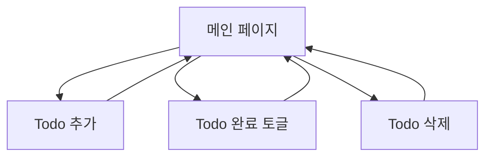

## 1. 제품 개요
간단하고 직관적인 Todo 애플리케이션으로, 사용자가 작업을 효율적으로 관리할 수 있도록 돕습니다.
개인의 일상 업무나 프로젝트 관리에 필요한 기본적인 작업 관리 기능을 제공합니다.

## 2. 핵심 기능

### 2.1 사용자 역할
이 제품은 별도의 사용자 인증 없이 단일 사용자 모드로 작동합니다.

### 2.2 기능 모듈
최소한의 Todo 애플리케이션 요구사항은 다음과 같은 주요 페이지로 구성됩니다:
1. **메인 페이지**: Todo 목록 표시, 새 Todo 추가, Todo 완료/미완료 토글, Todo 삭제

### 2.3 페이지 상세
| 페이지명 | 모듈명 | 기능 설명 |
|-----------|-------------|-------------|
| 메인 페이지 | Todo 목록 | 모든 Todo 항목을 표시하고 완료 상태를 시각적으로 구분 |
| 메인 페이지 | Todo 추가 | 새로운 Todo 항목을 입력하고 추가 |
| 메인 페이지 | Todo 상태 토글 | Todo의 완료/미완료 상태를 전환 |
| 메인 페이지 | Todo 삭제 | 불필요한 Todo 항목을 제거 |

## 3. 핵심 프로세스
사용자는 앱에 접속하면 즉시 Todo 목록을 볼 수 있습니다. 새로운 Todo를 추가하고, 완료한 항목은 체크표시로 표시되며, 필요 없는 항목은 삭제할 수 있습니다.

## 4. 사용자 인터페이스 설계

### 4.1 디자인 스타일
- 주요 색상: 중립적인 그레이와 블루 톤
- 보조 색상: 녹색(완료), 빨간색(삭제)
- 버튼 스타일: 둥근 모서리의 플랫 디자인
- 폰트: 시스템 기본 폰트 사용
- 레이아웃: 중앙 정렬된 카드 기반 디자인
- 아이콘: 간단한 라인 아이콘 사용

### 4.2 페이지 설계 개요
| 페이지명 | 모듈명 | UI 요소 |
|-----------|-------------|-------------|
| 메인 페이지 | Todo 목록 | 깔끔한 카드 리스트 형태로 각 Todo 표시, 완료된 항목은 취소선과 연한 색상으로 시각적 구분 |
| 메인 페이지 | Todo 추가 | 상단에 위치한 입력창과 추가 버튼, 미니멀한 디자인 |
| 메인 페이지 | Todo 항목 | 각 항목 옆에 체크박스와 삭제 버튼을 배치하여 직관적인 조작 |

### 4.3 반응형 디자인
데스크톱 우선 접근 방식을 채택하며, 모바일 기기에서도 적절히 표시됩니다. 터치 상호작용을 고려하여 버튼 크기를 충분히 확보합니다.